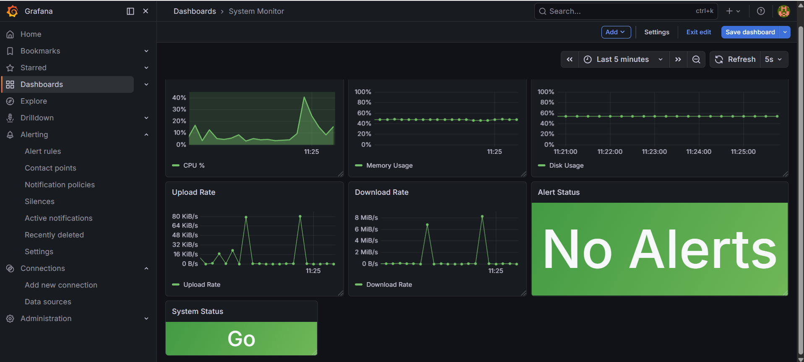
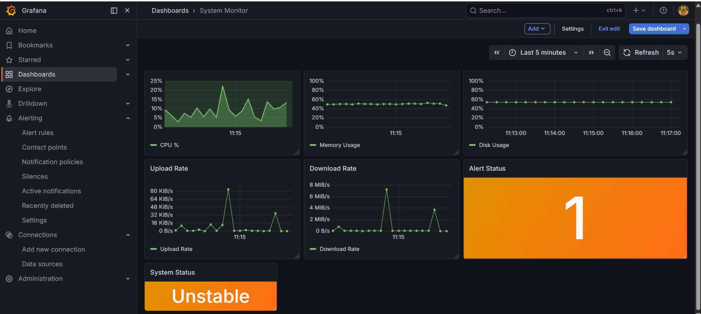
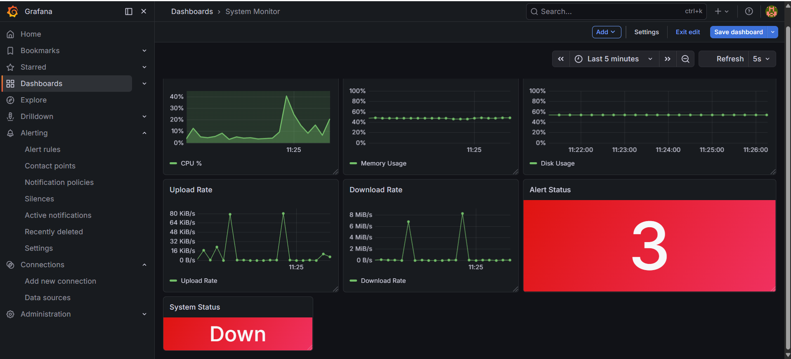
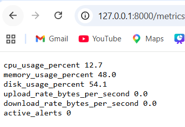
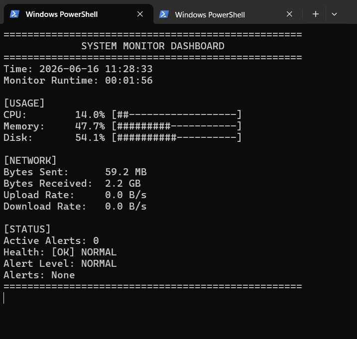
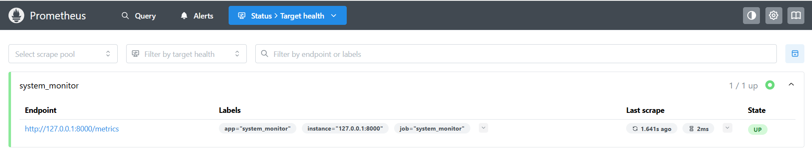

# System Monitor

A real-time system monitoring dashboard built with Python, Flask, Prometheus, and Grafana. The project tracks local machine performance metrics such as CPU usage, memory usage, disk usage, network upload/download rates, and active alerts. Metrics are exposed through a Flask `/metrics` endpoint, scraped by Prometheus, and visualized in Grafana.

## Features

* Real-time CPU, memory, and disk usage monitoring
* Network upload and download rate tracking
* Prometheus-compatible `/metrics` endpoint
* Grafana dashboard with live visualizations
* Alert status panel for active alert count
* System status panel with `Go`, `Unstable`, and `Down` states
* CSV logging for historical metric data
* Terminal-based dashboard for local monitoring

## Tech Stack

* Python
* Flask
* psutil
* Prometheus
* Grafana
* CSV logging

## Project Architecture

```text
Python monitor.py
        |
        v
Flask /metrics endpoint
        |
        v
Prometheus scrape target
        |
        v
Grafana dashboard
```

The Python application collects system metrics using `psutil`, exposes them through a Flask endpoint, and continuously writes metric data to a CSV file. Prometheus scrapes the `/metrics` endpoint, and Grafana visualizes the data in a live dashboard.

## Monitored Metrics

The application exposes the following Prometheus metrics:

```text
cpu_usage_percent
memory_usage_percent
disk_usage_percent
upload_rate_bytes_per_second
download_rate_bytes_per_second
active_alerts
```

## Alert Logic

The monitor uses threshold-based alerting:

```text
CPU usage > 80%      → Warning
Memory usage > 85%   → Critical
Disk usage > 90%     → Emergency
```

The `active_alerts` metric is used by Grafana to update the Alert Status and System Status panels.

## Dashboard States

The Grafana dashboard includes three system states:

```text
Go        → No active alerts
Unstable  → One active alert
Down      → Multiple active alerts
```

The Alert Status panel displays the number of active alerts, while the System Status panel displays a simplified health state.

## Screenshots

### Normal Dashboard



### Unstable Dashboard



### Down Dashboard



### Metrics Endpoint



### Terminal Dashboard



### Prometheus Target Health



## Setup Instructions

### 1. Clone the repository

```bash
git clone https://github.com/your-username/system-monitor.git
cd system-monitor
```

### 2. Install Python dependencies

```bash
pip install -r requirements.txt
```

### 3. Run the Python monitor

```bash
python monitor.py
```

The metrics endpoint will be available at:

```text
http://127.0.0.1:8000/metrics
```

### 4. Configure Prometheus

Create or update `prometheus.yml` with the following scrape configuration:

```yaml
global:
  scrape_interval: 5s

scrape_configs:
  - job_name: "system_monitor"
    static_configs:
      - targets: ["127.0.0.1:8000"]
        labels:
          app: "system_monitor"
```

Start Prometheus:

```bash
prometheus.exe
```

Prometheus will be available at:

```text
http://localhost:9090
```

Check target health by going to:

```text
Status → Target health
```

The `system_monitor` target should show as `UP`.

### 5. Open Grafana

Start Grafana and open:

```text
http://localhost:3000
```

Add Prometheus as a data source using:

```text
http://localhost:9090
```

Then create dashboard panels using the metrics listed above.

## Grafana Panels

Recommended dashboard panels:

| Panel         | Query                            | Visualization |
| ------------- | -------------------------------- | ------------- |
| CPU Usage     | `cpu_usage_percent`              | Time series   |
| Memory Usage  | `memory_usage_percent`           | Time series   |
| Disk Usage    | `disk_usage_percent`             | Time series   |
| Upload Rate   | `upload_rate_bytes_per_second`   | Time series   |
| Download Rate | `download_rate_bytes_per_second` | Time series   |
| Alert Status  | `active_alerts`                  | Stat          |
| System Status | `clamp_max(active_alerts, 2)`    | Stat          |

## What I Learned

This project helped me practice building an end-to-end monitoring system using industry-standard observability tools. I learned how to collect system metrics, expose them in a Prometheus-compatible format, configure Prometheus scraping, and design Grafana dashboards for live monitoring and alert visualization.

## Future Improvements

* Add Docker Compose support for easier setup
* Add email or Slack notifications for alerts
* Store historical metrics in a database
* Add authentication for the Flask metrics endpoint
* Export and version-control the Grafana dashboard JSON
* Deploy the monitor to a cloud VM or home server
